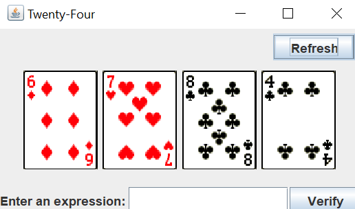
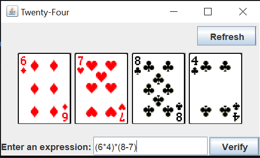
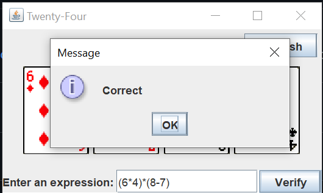

# Twenty-Four

## Description
A Java GUI clone of the Chinese Twenty-Four Card Game. Designed using java, GUI made using swing and awt. I designed the back-end portion; through the usage of the stack data structure and string tokenizers, an infix to postfix converter and evaluator were designed to evaluate the user's input.

## Algorithm used
   1. Scan the infix expression from left to right. 
   2. If the scanned character is an operand, output it. 
   3. Else, 
            a. If the precedence of the scanned operator is greater than the precedence of the operator in the stack(or the stack is empty or the stack contains a ‘(‘ ), push it. 
            b. Else, Pop all the operators from the stack which are greater than or equal to in precedence than that of the scanned operator. After doing that Push the scanned operator to the stack. (If you encounter parenthesis while popping then stop there and push the scanned operator in the stack.) 
4. If the scanned character is an ‘(‘, push it to the stack. 
5. If the scanned character is an ‘)’, pop the stack and output it until a ‘(‘ is encountered, and discard both the parenthesis. 
6. Repeat steps 2-6 until infix expression is scanned. 
7. Print the output 
8. Pop and output from the stack until it is not empty.

## Usage

  
&nbsp; &nbsp; &nbsp; &nbsp;
  
  &nbsp; &nbsp; &nbsp; &nbsp;
  

